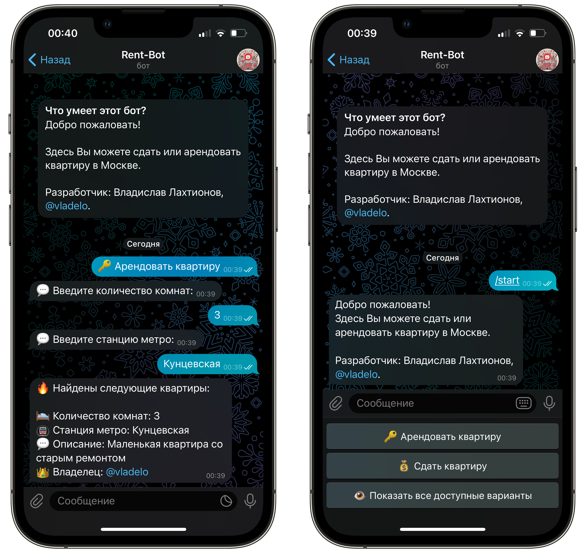
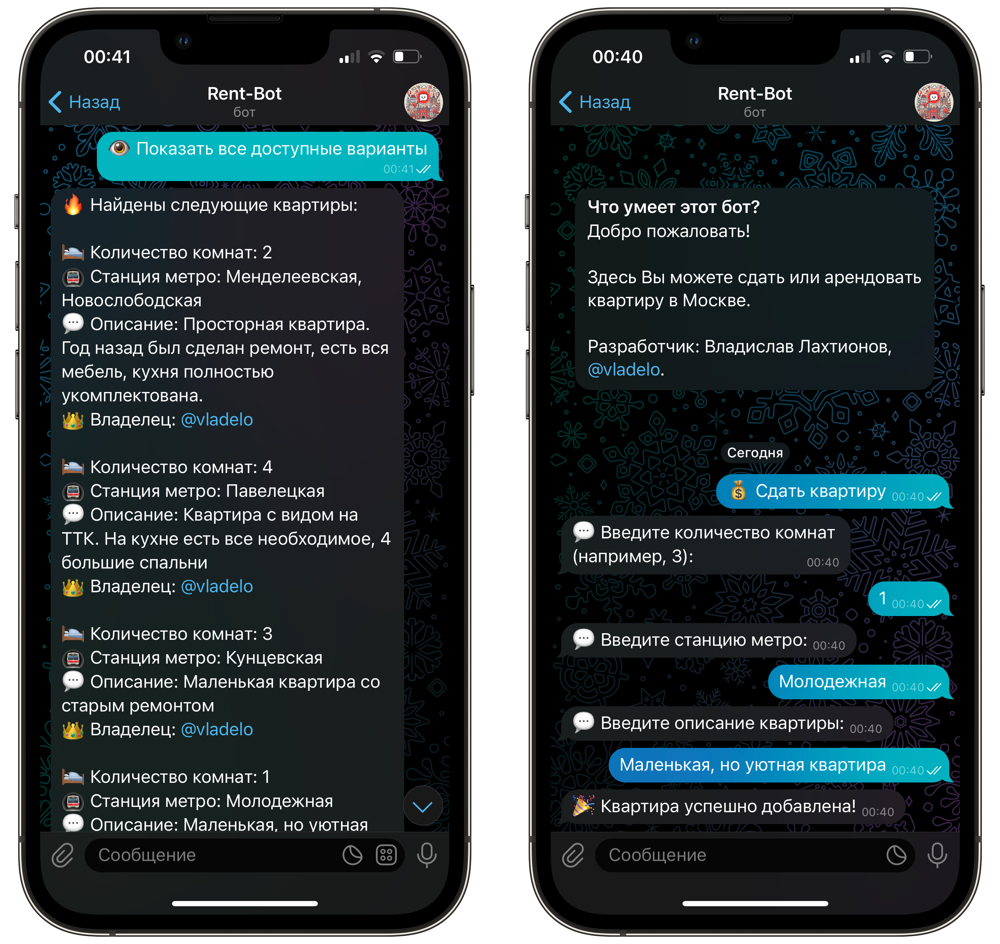

# 🏡 Rent-Bot

**Rent-Bot** — удобный Telegram-бот для аренды и сдачи квартир в Москве.  
С его помощью вы легко сможете найти подходящее жилье или разместить объявление о сдаче квартиры.  

## 📦 Основные возможности  
- 🔑 **Арендовать квартиру:** быстрый поиск по количеству комнат и станции метро.  
- 💰 **Сдать квартиру:** добавьте информацию о количестве комнат, станции метро и краткое описание.  
- 👁️ **Просмотр всех доступных квартир:** мгновенный вывод всех актуальных объявлений.  

## 🚀 Технологии
- Язык программирования: **Python 3**  
- Фреймворк: **Aiogram**  
- Управление состояниями: **FSM (Finite State Machine)**  
- Хранение данных: **JSON-файл**  
- Асинхронная работа: **asyncio**  




## 🛠️ Установка и запуск
1. Клонируйте репозиторий:
   ```bash
   git clone https://github.com/vladelo-777/rent-bot.git
   cd rent-bot
   ```
2. Установите зависимости:
   ```bash
   pip install -r requirements.txt
   ```
3. Создайте файл **`apartments.json`** с начальными данными, например:
   ```json
   [
       {
           "rooms": 2,
           "metro": "Менделеевская, Новослободская",
           "description": "Просторная квартира с ремонтом и всей необходимой мебелью.",
           "owner": "vladelo"
       },
       {
           "rooms": 4,
           "metro": "Павелецкая",
           "description": "Квартира с видом на ТТК, четыре спальни, кухня с техникой.",
           "owner": "vladelo"
       }
   ]
   ```
4. Запустите бота:
   ```bash
   python bot.py
   ```
5. Бот успешно запущен! Проверьте в Telegram.  

## 📝 Использование
- Начните с команды **/start**.  
- Выберите действие:  
  - 🔑 Арендовать квартиру  
  - 💰 Сдать квартиру  
  - 👁️ Показать все доступные варианты  

## 📬 **Контакты**

Автор: Владислав Лахтионов  
GitHub: [vladelo777](https://github.com/vladelo777)  
Telegram: [@vladelo](https://t.me/vladelo)  

💌 Не забудьте поставить звезду ⭐ на GitHub, если вам понравился бот! 😉
